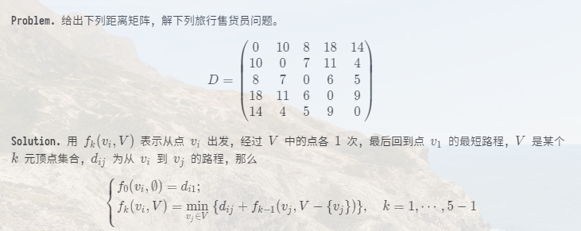

# A dynamic programming problem: TSP

(我现在无法直接管理我之前的博客——先暂时在这简陋的平台看看吧。)



<!-- **Problem.** 给出下列距离矩阵, 解下列旅行售货员问题。
$$
D=\begin{pmatrix}
0  & 10 & 8 & 18 & 14 \\
10 & 0  & 7 & 11 & 4  \\
8  & 7  & 0 & 6  & 5  \\
18 & 11 & 6 & 0  & 9  \\
14 & 4  & 5 & 9  & 0  \\
\end{pmatrix}
$$

**Solution.** 用 $f_k(v_i,V)$ 表示从点 $v_i$ 出发, 经过 $V$ 中的点各 $1$ 次, 最后回到点 $v_1$ 的最短路程, $V$ 是某个 $k$ 元顶点集合, $d_{ij}$ 为从 $v_i$ 到 $v_j$ 的路程, 那么
$$
\left\{
\begin{aligned}
& f_0(v_i, \emptyset)=d_{i1};                                                              \\
& f_k(v_i, V)= \min_{v_j\in V} \ \{ d_{ij}+f_{k-1}(v_j,V-\{v_j\}) \}, \quad k=1,\cdots,5-1
\end{aligned}
\right.
$$ -->

接下来可以考虑手算了。我着实觉得手算太花时间, 毕竟我知道怎么算, 而且这问题也并不是考我算术吧? 嗯, 就基于上面的递推公式, 写个 Python 程序算算。代码如下:

```python
class TSP:  # traveling salesman problem
    def __init__(self, numberOfVertices: int, infinity: int = 666666):
        # 'infinity' is a sufficiently large integer
        self.num: int = numberOfVertices
        self.infinity: int = infinity
        self.mat = [[self.infinity for j in range(self.num)]
                    for i in range(self.num)]
        for i in range(self.num):
            self.mat[i][i] = 0

    def solve(self, start: int, stop: int, *vertices: int) -> dict:
        # solve(start, stop, vertices) finds ONE OF THE SHORTEST PATHS
        # from 'start' to 'stop'
        # Notice: the index starts at 0 (not at 1)!
        ans = {
            'distance': self.infinity,
            'path': [start]
            # the path does not contain 'stop'. This makes
            # concatenation easier (as shown in lines 12, 27-29):
            # path from A to C = path from A to B + path from B to C
        }
        td: int = 0  # temporary distance
        ti: int = 0  # temporary index
        t_dict = {}  # temporary dictionary
        if (len(vertices) == 0):
            ans['distance'] = self.mat[start][stop]
            return ans
        else:
            for j in vertices:
                t_dict = self.solve(j, stop, *[k for k in vertices if k != j])
                td = self.mat[start][j] + t_dict['distance']
                if (td < ans['distance']):
                    ans['distance'] = td
                    ti = j
            ans['path'].extend(
                self.solve(ti, stop,
                           *[k for k in vertices if k != ti])['path'])
            return ans

    def result(self, start: int, stop: int, *vertices: int):
        answer = self.solve(start, stop, *vertices)
        print('The shortest distance is %d.' % (answer['distance']))
        print('The shortest path is:')
        for vertex in answer['path']:
            print(vertex, end=' -- ')
        print(stop)


def main(*args, **kwargs):
    n: int = 5
    a = TSP(n)
    a.mat = [[0, 10, 8, 18, 14], [10, 0, 7, 11, 4], [8, 7, 0, 6, 5],
             [18, 11, 6, 0, 9], [14, 4, 5, 9, 0]]
    start: int = 0
    stop: int = 0
    a.result(start, stop, *range(1, n))


main()

```

结果如下:

```
The shortest distance is 37.
The shortest path is:
0 -- 1 -- 4 -- 3 -- 2 -- 0
```

这给出最短路程为 37。由于 Python 等一系列编程语言的索引是从 0 而非 1 开始 (我写程序的时候为了方便, 也使用 0), 所以 (用 $1,\cdots,n$ 表示的) 一条最短路径是
$$
1 \rightarrow 2 \rightarrow 5 \rightarrow 4 \rightarrow 3 \rightarrow 1
$$
